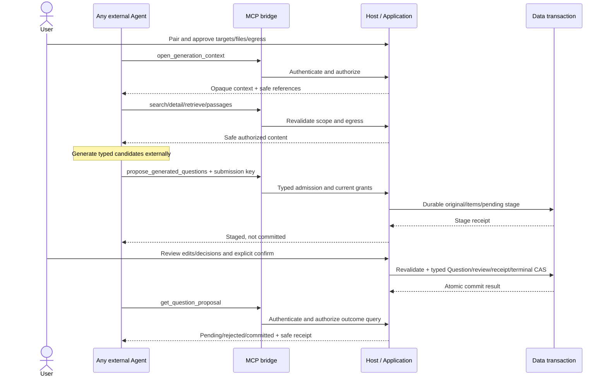

# MCP vNext Local Generation Profile

Status: **FROZEN target capability surface; not implemented by AR-R0.**

Authority/activation: [index](README.md). Owns MCP projections/protocol and
reference-package boundary, not business identity, authorization or commit.
Full wire schemas/version identifiers are frozen in AR-R6B before exposure.

## 1. Local Tools-only profile

External Client -> stdio MCP bridge -> authenticated local IPC -> App Host ->
Application. Identity/context/egress rules are owned by
[external-agent-boundary.md](external-agent-boundary.md). Bridge has no database,
repository, migrations or alternate App writer.

| Tool | Minimum input intent | Safe output / permission |
|---|---|---|
| open_generation_context | Optional server-minted target reference | Without target: bounded/paged authorized target metadata; with target: opaque handle and approved evidence references; READ |
| search_questions | context handle, bounded search/cursor | Context-scoped question projection; READ |
| get_question_detail | context handle, server-returned question reference | Authorized typed question projection; READ |
| retrieve_file_content | context handle, bounded lexical query | Verified current RAG snippets/evidence; READ with permitted derived cache |
| get_file_passage | context handle, returned evidence reference/cursor | Bounded verified parsed passages and coverage/exclusion metadata; READ |
| propose_generated_questions | context handle, submission key, typed candidates | Durable Proposal identity/count/receipt, explicitly staged not committed; STAGE |
| get_question_proposal | Proposal reference or submission key | Currently authorized lifecycle/count/safe receipt, without needing old handle; READ |

Generation targets are selected in Shiroha pairing; no extra list_learning_spaces
is needed. get_question_draft/list_pending_proposals are excluded from MVP;
external clients do not edit the local review copy and can reconcile by key.
No W0/SPL external staging, commit, delete, OCR activation or arbitrary file path.

Both retrieval and passage read current verified SourceDocument through
Application. No raw managed originals, URLs, binaries, diagnostics or unsafe
fallback content. source_not_ready instructs parsing in App rather than invoking
OCR. Page/cursor output distinguishes remaining content and excluded structure;
search hits are not evidence of complete document reading.

Projections perform shape/schema parsing and encoding. Application validates
typed semantics, authorization, scope and egress. Validate structured result
against its declared schema; output encoding failure preserves known receipt.
Object-shaped structured output with safe compatible text supports legacy
clients; never pass repository maps. Business/tool failure and JSON-RPC protocol
error remain distinct. Safe errors include unavailable/busy/unauthorized/stale,
invalid submission/idempotency conflict and known or unknown execution outcome.
No raw exception/body or existence leak.

## 2. v0 coexistence and protocol versions

[MCP v0](../../architecture/mcp-v0-contract.md) retains exactly six READ_ONLY
tools, existing envelopes and independent entrypoint. vNext is a separate
profile/entrypoint; it is not a seventh v0 tool, v0 authentication retrofit or
authority to mutate. `mcp_dart` stays under `lib/mcp/**`; no SDK/dependency change
is authorized by this checkpoint.

Version MCP wire, Shiroha profile, submission schema and IPC envelope separately.
Use the pinned SDK's compatibility support rather than implementing Provider/
MCP versions in the business layer. Unknown versions fail explicitly. AR-R6B
tests actual supported modern and legacy protocol behavior, not only direct
callback invocation.

Official protocol reference verified during design is 2026-07-28: stateless
per-request metadata/server discovery, explicit handles and Tasks extension.
This observation does not freeze SDK behavior forever or claim every installed
client supports that revision. Recheck official SDK/protocol at implementation;
any upgrade requires a separately reviewed compatibility change.

Tools list is deterministic for the same configured profile/modules, not changed
per open context. Definition visibility is not authorization. READ annotations
are hints; STAGE is not read-only and idempotent is asserted only when the
business contract supports it. Annotations never grant COMMIT.

## 3. Lifecycle, progress and cancellation

Map request cancellation/deadline through IPC to Application. READ cancellation
stops unreleased content where possible. STAGE past durable commit returns or
reconciles its receipt; disconnect/timeout cannot imply undo or zero effect.
Report fixed progress stage/counts only, without query/candidate/source content.

App absence/restart/restore/revoke follows external boundary; never open SQLite
as fallback. stdout is exclusively protocol framing; safe logs use stderr.
No MCP logging/raw-body export is introduced. Protocol request id is not durable
submission identity. Each in-flight unknown STAGE is reconciled by its key.

## 4. Complete workflow

Every MCP client that supports Tools can complete this flow; Resources/Prompts
are optional future projections with the same authorization. Prompts only guide
use; Resources only expose safe authorized snapshots. MCP Tasks, sampling,
external formal approval and hosted remote transport are excluded from MVP.

## 5. First-party reference integration

Codex is a reference client, not a business Module or a special Proposal origin.
A separate integration repository packages manifest/MCP/Skill/assets, not the
Flutter repository. Skill teaches open/read/check duplicates/generate/stage/
review/status and must never say staged means formally saved.

Preferred current portable layout is root plugin.json/mcp.json/skills/assets
with OpenAI-specific metadata in extensions.com.openai. Legacy .codex-plugin
overlay is compatibility, not a requirement to build Shiroha-specific business.
Use installed shiroha-mcp bridge; do not pub-get/build Flutter or auto-download/
install executables through lifecycle hooks. Bare command or contained plugin
relative executable is validated with supported Codex versions. Manifest,
bridge and capability-profile versions are distinct; paths/Windows env casing
must pass real launch fixtures.

Git/local marketplace distribution is the initial reference-package route.
Public-directory hosted/local eligibility and Windows executable installation/
discovery/minimum client version remain NEEDS IMPLEMENTATION-SPIKE in AR-R9B.
No public-hosted deployment or signing/release change is authorized here.
Claude/Gemini/Qwen/Cursor/Ollama/custom clients use the same generic profile;
future protocol adapters do not alter Proposal Domain. Plugin removal never
deletes App data. Reference package works without Resources/Prompts.

Official design sources (recheck at implementation):
[MCP revision](https://modelcontextprotocol.io/specification/2026-07-28/changelog),
[Tools](https://modelcontextprotocol.io/specification/2026-07-28/server/tools),
[Tasks extension](https://modelcontextprotocol.io/extensions/tasks/overview),
[Plugin packaging](https://developers.openai.com/plugins/build/plugins),
[public submission](https://developers.openai.com/plugins/deploy/submission).

## 6. Acceptance / rollback

AR-R6B proves Tools-only synthetic end-to-end over actual stdio protocol, input/
output schemas, pairing/context scopes, non-enumeration, passage coverage,
cancel/progress, unavailable/revoke/restart, duplicate/lost stage response and
authorized outcome lookup. v0 exactly-six and SDK-confinement regressions stay.
AR-R9 separately proves optional projections and installed reference package.
Disable vNext entrypoint/Host routes without changing v0, Proposal data or typed
Question compatibility. Runtime/Provider/UI rewrites are not MCP prerequisites.
